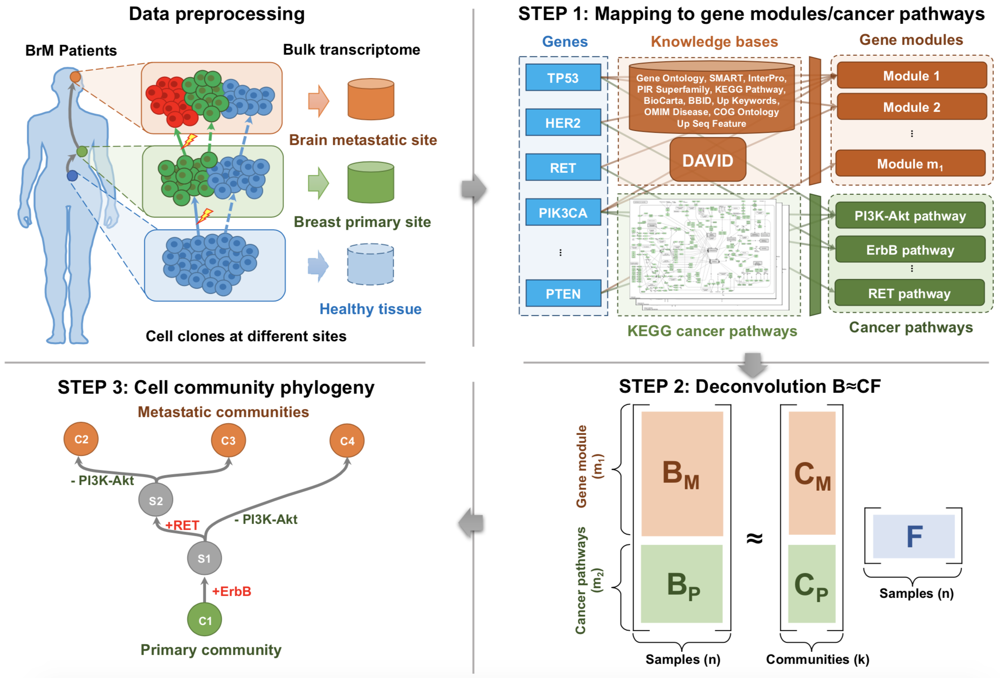

# Phylogenies of Breast Cancer Brain Metastases




## Introduction

This repository contains the code and data for the following work: 
Yifeng Tao, Haoyun Lei, Adrian V. Lee, Jian Ma, and Russell Schwartz. 
**Phylogenies Derived from Matched Transcriptome Reveal the Evolution of Cell Populations and Temporal Order of Perturbed Pathways in Breast Cancer Brain Metastases**. Proceedings of the International Symposium on Mathematical and Computational Oncology (ISMCO). 2019.


## How to use the pipeline?

### STEP 0: Prerequisites

The code runs on `Python 2.7`.
* Common Python packages need to be installed: `os`, `random`, `numpy`, `pandas`, `pickle`, `scipy`, `sklearn`, `matplotlib`, `seaborn`, `cStringIO`, `collections`.
* These additional Python packages are required in some experiments: `statsmodels`, `networkx`, `skbio`, `Bio`, `PyTorch`.


We will introduce the three-step pipeline below.

### STEP 1: Data preprocessing and mapping to gene modules/cancer pathways

You can load the preprocessed mapped data (`df_modu`) using the following pieces of scripts in Python environment:
```python
from DataProcessor import DataProcessor
data_proc = DataProcessor()
df_modu, len_kegg = data_proc.load_modu_data()
```
As you can see, we uses the `DataProcessor` class to conduct the data preprocessing and mapping. The returned `df_modu` is a `pandas.DataFrame`, where each row is a gene module/cancer pathway, and each column is a sample.


### STEP 2: Deconvolution of bulk data

We want to conduct cross-validation to determine the proper number of cell communities/components for deconvolution:
```python
python cv_ica.py
```
This step finds the optimal number of components for deconvolution. Results available at `data/ica/results_cv.pkl`.

Then, using the optimal number of components (`dim_k=5`) as parameter, we can conduct the deconvolution:
```python
python run_ica.py
```
This unmixes the bulk data. Results available at `data/ica/BCF.pkl`.


### STEP 3: Building cell community phylogeny and inferring Steiner node pathways

Some cell components are missing in some patients. We can check the different patterns of exiting components in patients:
```python
import pickle
from DataProcessor import DataProcessor
from utils_analysis import component_portion, classify_patients, plot_phylo
# Load preprocessed data
data_proc = DataProcessor()
df_modu, len_kegg = data_proc.load_modu_data()
# Load deconvolved components and fraction matrix
BCF = pickle.load(open( "data/ica/BCF.pkl", "rb" ))
B, C, F = BCF["B"], BCF["C"], BCF["F"]
# Index of the primary component/community
comp_p = component_portion(F, plot_mode=True)
# Aggregate different patterns of components in patients
list_patterns = classify_patients(F, threshold_0=2.5e-2)
```
Here, the `list_patterns` contains four different patterns of phylogenies. In order to visualize the first pattern and print out the differentially perturbed pathways along edges of this phylogeny:
```python
pattern = list_patterns[0]
plot_phylo(C, F, list(df_modu.index), len_kegg, comp_p, pattern, threshold=0.05)
```


## How to replicate results in the paper?

```python
python cv_ica.py
```
It plots Fig. 2b in the paper.

```python
python run_ica.py
```
It plots Fig. A1, Fig. A2 in the paper.

```python
python analysis.py
```
It prints out the following figures or plots tables of the paper in the order of: Fig. 3b, Table 1, Table A1, Fig. 3a, Fig. 3c, Fig. A3, Fig. 3d, Fig. 3e, Table A2-A5.

## License

The repository uses MIT license, so feel free to share or adapt the materials. If you find this work useful, please cite:
```
@inproceedings{tao2019brm,
  title = {Phylogenies Derived from Matched Transcriptome Reveal the Evolution of Cell Populations and Temporal Order of Perturbed Pathways in Breast Cancer Brain Metastases},
  author = {Tao, Yifeng and
	Lei, Haoyun  and
	Lee, Adrian V.  and
	Ma, Jian  and
	Schwartz, Russell},
  booktitle = {Proceedings of the International Symposium on Mathematical and Computational Oncology},
  month = {Oct},
  year = {2019},
}
```

You are welcome to contact us if you have any question.

Contact: Yifeng Tao (yifengt@cs.cmu.edu), Russell Schwartz (russells@andrew.cmu.edu)


